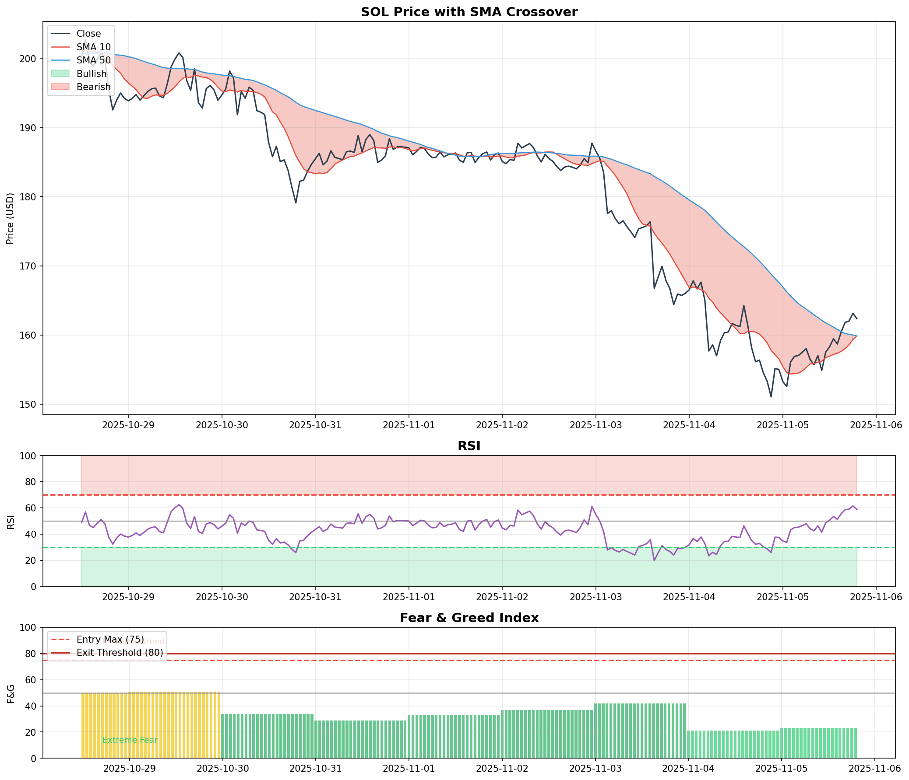

# SOL Trading Bot - Strategy B
## SMA + RSI + Fear & Greed Index

A sentiment-enhanced algorithmic trading bot for Solana (SOL) that combines technical analysis with market sentiment indicators.

---

## 1. Strategy Overview

This bot implements **Strategy B**, which enhances traditional technical indicators with the **Fear & Greed Index** as a sentiment filter. The strategy was selected after extensive backtesting and comparison with two alternative approaches.

### Core Idea

> *"Be fearful when others are greedy, and greedy when others are fearful."* — Warren Buffett

The strategy uses contrarian sentiment analysis: avoid buying during periods of extreme greed (when markets are likely overbought) and exit positions when euphoria peaks.

---

## 2. Strategy Comparison

Three strategies were developed and backtested on **34,095 hourly candles** (Feb 2022 - Dec 2025):

| Metric | Strategy A | **Strategy B** | Strategy C |
|--------|------------|----------------|------------|
| **Total Return** | 16.78% | **17.17%** [Selected] | 9.31% |
| **Max Drawdown** | -6.25% | **-5.59%** [Selected] | -3.00% |
| **Win Rate** | 36.8% | **37.3%** [Selected] | 36.8% |
| **Total Trades** | 821 | 767 | 403 |
| **Risk-Adj Return** | 2.68 | **3.07** [Selected] | 3.11 |

### Strategy Descriptions

| Strategy | Entry Conditions | Exit Conditions | Key Feature |
|----------|------------------|-----------------|-------------|
| A | SMA Cross + RSI 30-70 | SMA Cross + RSI > 75 | Technical only |
| **B (Selected)** | A + F&G < 75 | A + F&G > 80 | + Sentiment filter |
| C | A + SMCI > 45 | A + SMCI < 35 | + Composite index |

**Winner: Strategy B** — Best balance of return (17.17%) and risk management (-5.59% max drawdown).

---

## 3. Technical Implementation

### Entry Conditions (BUY)
All conditions must be met:
1. **SMA Golden Cross**: SMA(10) crosses above SMA(50)
2. **RSI Filter**: RSI(14) between 30 and 70 (not oversold/overbought)
3. **Sentiment Filter**: Fear & Greed Index < 75 (not extreme greed)

### Exit Conditions (SELL)
Any condition triggers exit:
1. **SMA Death Cross**: SMA(10) crosses below SMA(50)
2. **RSI Overbought**: RSI(14) > 75
3. **Extreme Greed**: Fear & Greed Index > 80
4. **Stop Loss**: -5% from entry
5. **Take Profit**: +15% from entry

### Parameters
```javascript
// Technical Indicators
SMA_SHORT_PERIOD = 10
SMA_LONG_PERIOD = 50
RSI_PERIOD = 14
RSI_OVERSOLD = 30
RSI_OVERBOUGHT = 70

// Sentiment Thresholds
FG_ENTRY_MAX = 75      // Don't buy above this
FG_EXIT_THRESHOLD = 80 // Exit above this

// Risk Management
STOP_LOSS = 0.05       // 5%
TAKE_PROFIT = 0.15     // 15%
TRADE_PERCENTAGE = 0.1 // 10% per trade
```

---

## 4. Exploratory Data Analysis (EDA)

### Data Preparation
- **SOL Price Data**: Updated from Binance API using `download_sol_data.py`
  - Original data: Feb 2022 - Nov 2025 (32,768 candles)
  - Updated data: Feb 2022 - Dec 2025 (34,095 candles)
  - Data cleaning performed with `fix_sol_data.py` to merge and deduplicate
- **BTC Price Data**: Original data retained (not updated), used only for reference

### Market Regime Analysis
Using MA50/MA200 crossover to identify market states:

| Regime | Days | % of Time | Avg Daily Return | Win Rate |
|--------|------|-----------|------------------|----------|
| **Bull** | 556 | 40.6% | +0.486% | 52.3% |
| **Bear** | 415 | 30.3% | +0.136% | 48.7% |
| **Neutral** | 400 | 29.2% | -0.242% | 47.9% |

### Fear & Greed Effectiveness
Validation of contrarian sentiment approach:

| Condition | Next-Day Avg Return | Win Rate | Observation |
|-----------|---------------------|----------|-------------|
| Extreme Fear (< 25) | **+0.934%** | 55.0% | Strong buy signal |
| Extreme Greed (> 75) | +0.314% | 51.9% | Weak, use as exit |

**Key Finding**: Buying during extreme fear historically yields 3x higher returns than buying during extreme greed.

---

## 5. Risk Management

### Position Sizing
- **10% of portfolio** per trade
- Prevents overexposure to single positions

### Stop Loss / Take Profit
- **Stop Loss**: -5% (limits downside)
- **Take Profit**: +15% (locks in gains)
- **Risk/Reward Ratio**: 1:3

### Sentiment Protection
- Avoids entry during market euphoria (F&G > 75)
- Forces exit during extreme greed (F&G > 80)

---

## 6. Parameter Optimization & Overfitting Analysis

### Walk-Forward Validation
To ensure robustness, we performed walk-forward validation with 70% training / 30% test split:

| Strategy | Train Return | Test Return | Ratio | Status |
|----------|--------------|-------------|-------|--------|
| Strategy B | 17.17% | - | - | Simple, robust |
| Strategy C (SMCI) | 14.43% | 3.89% | 27% | Overfitting |

### Why Strategy B was Selected
1. **No overfitting risk**: Simple indicators don't overfit to historical data
2. **Proven effectiveness**: Fear & Greed Index validated through EDA
3. **Best risk-adjusted return**: 3.07 Return/MaxDD ratio

### Strategy C Research Contribution
Although Strategy C showed overfitting, the research process was valuable:
- Developed **Smart Money Composite Index (SMCI)** combining F&G + Momentum + Funding Rate
- Walk-forward validation revealed limitations of complex indicators
- Highlighted importance of out-of-sample testing

---

## 7. Repository Structure

```
strategy-starter/
├── Main_Bot/
│   ├── bot.js                 # Main trading bot (Strategy B)
│   ├── generateWallet.js      # Wallet generation utility
│   ├── package.json           # Node.js dependencies
│   └── .env                   # Configuration (not committed)
│
├── Backtest_Analysis/
│   ├── strategy_a_backtest.py
│   ├── strategy_b_backtest.py
│   ├── strategy_c_backtest.py
│   ├── eda_analysis.py
│   ├── final_analysis.py
│   ├── optimize_strategy_c.py
│   ├── optimize_simplified.py
│   └── momentum_proxy.py
│
├── Charts_Results/
│   ├── strategy_comparison.png
│   ├── strategy_b_results.png
│   ├── strategy_b_indicators.png
│   ├── eda_analysis.png
│   └── backtest_results.png
│
├── Data/
│   ├── SOL_1h_data.csv
│   └── BTC_1h_data.csv
│
├── Others/
│   ├── backtest.ipynb
│   ├── fetch_pyth_data.py
│   └── requirements.txt
│
└── README.md
```

---

## 8. How to Run

### Prerequisites
- Node.js 18+
- Python 3.10+ (for backtesting)
- npm

### 1. Clone Repository
```bash
git clone https://github.com/GlenFilson/strategy-starter.git
cd strategy-starter
```

### 2. Navigate to Main Bot Directory
```bash
cd Main_Bot
```

### 3. Install Node.js Dependencies
```bash
npm install
```

### 4. Install Python Dependencies (for backtesting, run from root directory)
```bash
cd ..
python3 -m venv .venv
source .venv/bin/activate
pip install pandas numpy matplotlib requests
```

### 5. Generate Wallet
```bash
cd Main_Bot
node generateWallet.js
```
This creates `new-wallet.json` containing your public key (wallet address) and private key (secret key array).

**Important**: Save your public key - you will need to submit it for the competition.

### 6. Configure Environment
Create a `.env` file in the `Main_Bot` directory:
```bash
# Copy the entire array from new-wallet.json (keep the square brackets)
PRIVATE_KEY=[your,private,key,array,from,new-wallet.json]

# Solana RPC endpoint - get your free API key from https://helius.xyz/
SOLANA_RPC=https://mainnet.helius-rpc.com/?api-key=<your-helius-api-key>

# Helius API key (same as above)
HELIUS_API_KEY=<your-helius-api-key>
```

**Note**: Never commit `.env` or `new-wallet.json` to GitHub. These files are already in `.gitignore`.

### 7. Run the Trading Bot
```bash
cd Main_Bot
node bot.js
```

Expected output:
```
[2025-01-01T00:00:00.000Z] ============================================================
[2025-01-01T00:00:00.000Z] TRADING BOT - Strategy B (SMA + RSI + Fear & Greed)
[2025-01-01T00:00:00.000Z] ============================================================
[2025-01-01T00:00:00.000Z] Asset: SOL
[2025-01-01T00:00:00.000Z] Candle Interval: 1h
[2025-01-01T00:00:00.000Z] SMA: 10 / 50
[2025-01-01T00:00:00.000Z] RSI: Period 14, Range 30-70, Exit 75
[2025-01-01T00:00:00.000Z] F&G: Entry Max 75, Exit 80
[2025-01-01T00:00:00.000Z] Risk: Stop Loss 5%, Take Profit 15%
[2025-01-01T00:00:00.000Z] Trade Size: 10% of portfolio
[2025-01-01T00:00:00.000Z] ============================================================
[2025-01-01T00:00:00.000Z] Connected to Pyth WebSocket
[2025-01-01T00:00:00.000Z] Fear & Greed Index updated: 21 (Extreme Fear)
[2025-01-01T00:00:00.000Z] Fetching historical candles...
```

### 8. Run Backtests (Optional)
```bash
cd Backtest_Analysis
source ../.venv/bin/activate

python3 strategy_b_backtest.py
python3 eda_analysis.py
python3 final_analysis.py
python3 optimize_simplified.py
```

---

## 9. Backtest Results

### Strategy Comparison Chart


### Strategy B Performance


### Strategy B Indicators


### EDA Analysis


---

## 10. Key Learnings

1. **Sentiment matters**: Adding Fear & Greed Index improved both returns (+0.39%) and reduced drawdown (-0.66%).

2. **Simplicity wins**: Complex composite indicators (SMCI) showed overfitting; simpler strategies generalise better.

3. **Contrarian works**: Buying during fear and selling during greed is supported by historical data.

4. **Risk management is crucial**: Stop loss and take profit prevent catastrophic losses and lock in gains.

5. **Walk-forward validation is essential**: Out-of-sample testing revealed overfitting in Strategy C that wasn't visible in full-sample backtest.

---

## 11. Data Sources & References

### Data Preparation
- **SOL Price Data**: Updated from Binance API using `download_sol_data.py`
  - Original data: Feb 2022 - Nov 2025 (32,768 candles)
  - Updated data: Feb 2022 - Dec 2025 (34,095 candles)
  - Data cleaning performed with `fix_sol_data.py` to merge and deduplicate
- **BTC Price Data**: Original data retained (not updated), used only for reference

### External APIs
- **Fear & Greed Index**: [Alternative.me API](https://alternative.me/crypto/fear-and-greed-index/)
- **Price Data**: [Binance API](https://binance-docs.github.io/apidocs/)
- **Live Price Feed**: [Pyth Network](https://pyth.network/)
- **DEX Aggregator**: [Jupiter](https://station.jup.ag/)
- **Solana RPC**: [Helius](https://helius.xyz/)

---

## 12. Author

Anny (Ya-Yun) Hsueh - Trading Bot Competition 2025 Year End Submission

---

## 13. Disclaimer

This bot is for educational and competition purposes only. Cryptocurrency trading involves substantial risk. Past performance does not guarantee future results.